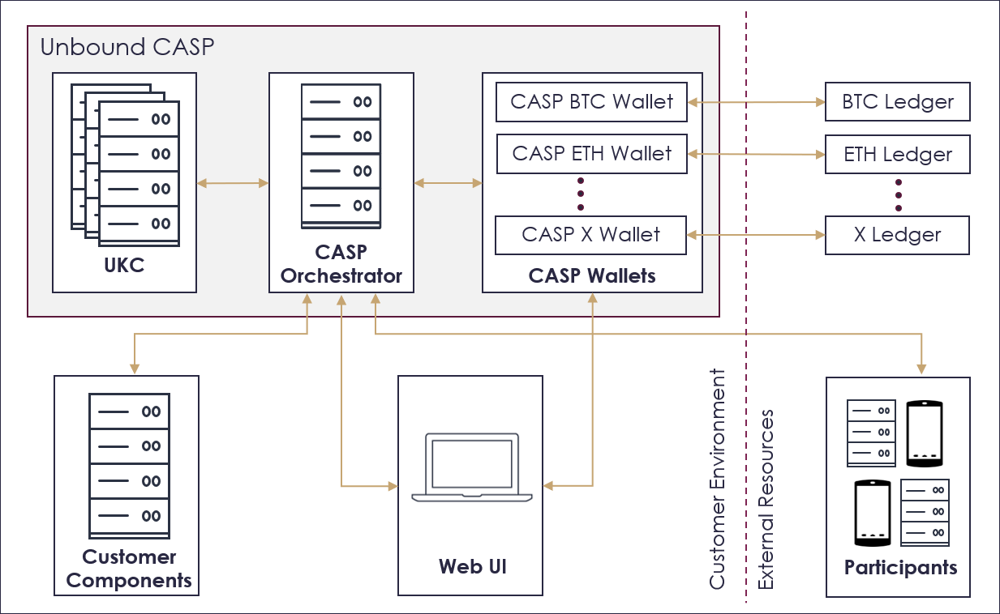

# CASP Express Deploy

Unbound’s Crypto Asset Security Platform (“**CASP**”) provides the advanced technology and the architecture to secure crypto asset transactions. An overview of the CASP solution is found [here](https://www.unboundsecurity.com/docs/CASP/CASP_User_Guide/Content/Products/CASP/CASP_Offering_Description/Solution.htm).

CASP can be rapidly deployed using one of these methods:
- [Docker](https://hub.docker.com/?overlay=onboarding)
    - Install CASP in a container.
    - This method is intended for POCs, demos and development.
    - The complete system runs on a single device.
    
The rapid installation process is described below. For the manual installation process, refer to the [CASP User Guide](https://www.unboundsecurity.com/docs/CASP/CASP_User_Guide/Content/Products/CASP/CASP_User_Guide/Installation.htm#Installing-CASP).

## Overview

The system architecture is shown in the following figure.

The CASP implementation is comprised of the following components:

1. **UKC** - Unbound Key Managment servers, including an Entry Point, Partner and Auxiliary server.
2. **PostgreSQL Database** - used by CASP Service.
3. **CASP Services** - including the CASP core service and CASP wallet service.
4. **CASP Bot** - a CASP participant that automatically approves operations.
5. **CASP Web UI** - a web interface used to manage CASP.

## General Prerequsites
The following are required before installing CASP. 
1. An Infura Project ID token (only needed for Ethereum ledger access). See [Infura](https://infura.io/register).
   - Register for the Infura site.
   - Create a new project.
   - Copy the access token from the project page.
1. A Blockset access token (only needed for Bitcoin ledger access). See [Blockset](https://blockset.com/docs).
   - Sign up for the Blockset site.
1. Firebase messaging token (to enable push notifications). [Contact Unbound](https://www.unboundsecurity.com/company/contact-us/) for it.

## Installation
After completing the prerequisites, follow the instructions in [Docker](./casp-docker).
